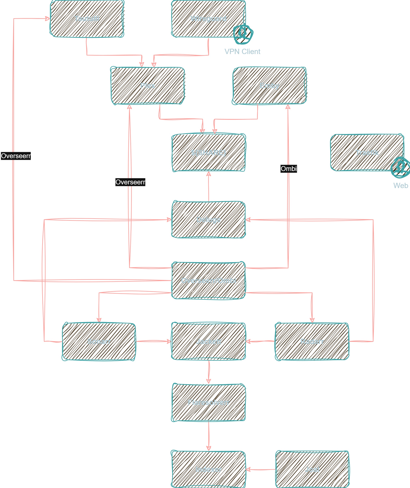

# My Beautiful Seedbox

## Disclamer

Please be aware that it is essential to abide by the law regarding downloading and streaming of content. Any illegal use of movies and tv shows is strictly prohibited.

## Apps

| Apps			       | External Access            | Local						| Docker image                                                           										| Tag 	   | Description               									 |
|----------------------|----------------------------|---------------------------|---------------------------------------------------------------------------------------------------------------|----------|-------------------------------------------------------------|
| Plex                 | plex.yourdomain.com        | plex:32400				| [plexinc/plex](https://hub.docker.com/r/plexinc/pms-docker/)          										| *latest* | Media Streaming     										 |
| Flaresolverr         | /       					| flaresolverr:8191			| [ghcr.io/flaresolverr/flaresolverr](https://github.com/flaresolverr/FlareSolverr/pkgs/container/flaresolverr)	| *latest* | Proxy server to bypass Cloudflare and DDoS-GUARD protection |
| Tautulli             | tautulli.yourdomain.com    | tautulli:8181 			| [linuxserver/tautulli](https://hub.docker.com/r/linuxserver/tautulli)    										| *latest* | Monitor & Analyse Plex for Overseerr 						 |
| Deluge               | deluge.yourdomain.com      | deluge:8112 				| [linuxserver/deluge](https://hub.docker.com/r/linuxserver/deluge)      										| *latest* | BitTorrent client 											 |
| Sonarr               | /					     	| sonarr:8989	 			| [linuxserver/sonarr](https://hub.docker.com/r/linuxserver/sonarr)      										| *latest* | TV Shows monitor    										 |
| Radarr               | /					        | radarr:7878 				| [linuxserver/radarr](https://hub.docker.com/r/linuxserver/radarr)      										| *latest* | Movies monitor      										 |
| Overseerr            | overseerr.yourdomain.com   | overseerr:5058 			| [sctx/overseerr](https://hub.docker.com/r/sctx/overseerr)														| *latest* | Application for managing requests for your media library	 |
| Jackett              | /					        | jackett:9117 				| [linuxserver/jackett](https://hub.docker.com/r/linuxserver/jackett)    										| *latest* | Tracker indexer     										 |
| Netdata              | netdata.yourdomain.com     | netdata:19999 			| [netdata/netdata](https://hub.docker.com/r/netdata/netdata)            										| *latest* | Metrics   													 |
| Traefik 			   | traefik.yourdomain.com     | traefik:(80,443,8080) 	| [traefik](https://hub.docker.com/_/traefik)                           										| *latest* | Traefik reverse proxy (access to admin dashboard) 			 |
| Joal				   | /						    | joal:1234		 			| [joal](https://hub.docker.com/r/anthonyraymond/joal)                       									| *latest* | Keep your ratio 											 |
| Uptime Kuma		   | uptime-kuma.yourdomain.com	| uptime-kuma:3001	 		| [Uptime Kuma](https://hub.docker.com/r/louislam/uptime-kuma)                         							| *latest* | Self-hosted monitoring tool 								 |											 
| Watchtower	   	   | /							| / 						| [Watchtower](https://hub.docker.com/r/containrrr/watchtower)         											| *latest* | Keep your docker image updated 							 |

## Description 

You need to configure apps as follow :



## Requirements

- OS : Debian / Ubuntu
- docker >= 24.04
- docker compose plugin >= 2.19.1

## Configuration

Download this project :

```bash
git clone https://github.com/z0rr0Day/MyBeautifulSeedbox.git
```

Edit `.env` file, to set `${ROOT}` folder, `${SHARE}` directory, your domain name and plex hostname.

Apps config are in `$(ROOT}/config/${APPS}`

## Start

```bash
cd ${ROOT}
docker compose up -d
```

## Stop

```bash
docker compose down
```

## Tips

### Monitor

Use [ctop](https://github.com/bcicen/ctop) to monitor your dockers or use portainer.

### SSH Tunnels

To access to a local service (which is not publish front of server)

```bash
ssh -p ${PORT} -L ${LOCAL_PORT}:${DOCKER_IP}:${REMOTE_PORT} ${USERNAME}@${DOMAIN}
```

Example :
```bash
ssh -p 18956 -L 19999:10.0.0.16:19999 user@mydomain.tld
# enter your password
```

Go to your favorite browser and `http://127.0.0.1:19999`
